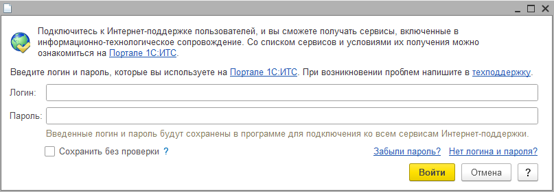

# &nbsp;&nbsp;&nbsp;&nbsp;&nbsp;&nbsp;&nbsp;&nbsp; FREE SOFTWARE REPO

---
---

### RegMSC

Utility for registering a 1C administration console with the possibility of starting it

###### 

look at https://infostart.ru/1c/tools/2454764/

---

### ОтключениеИнтернетПоддержки

Расширение для конфигураций на базе БСП, которое убирает назойливое окно при запуске 1С:Предприятия

_Для платформ 8.3.14+_

###### 

---
