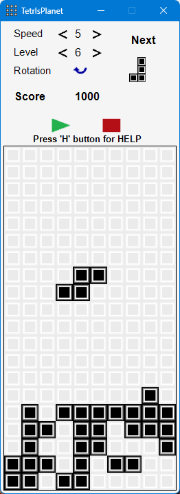
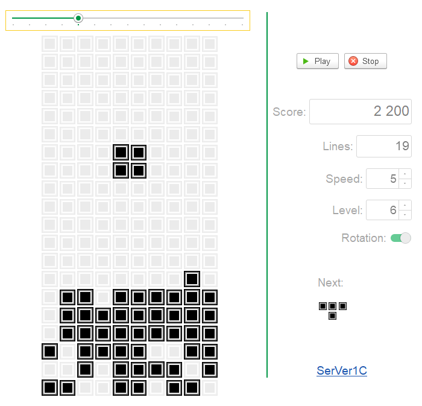

# &nbsp;&nbsp;&nbsp;&nbsp;&nbsp;&nbsp;&nbsp;&nbsp; FREE SOFTWARE REPO

---
---

### RegMSC

Utility for registering a 1C administration console with the possibility of starting it

###### 

look at https://infostart.ru/1c/tools/2454764/

---

### ОтключениеИнтернетПоддержки

Расширение для конфигураций на базе БСП, которое убирает назойливое окно при запуске 1С:Предприятия

_Для платформ 8.3.14+_

###### 

---

### РасширяемВозможностиPostgreSQL

Расширение с одним внешним источником данных и одной обработкой, позволяющее протестировать использование пользовательских функций во внешней базе PostgreSQL

смотри публикацию https://infostart.ru/1c/articles/2628672/

_Для платформ 8.3.24+_

---

### TETR1C

Тетрамино на C#

Оригинал был написан в 2011 году под .NET Framework 2.0

Эта версия скомпилирована под актуальную платформу и убраны персональные данные из описания.

_Для .NET Framework 4.8.1_

###### 

Ну а версию для 1С 

###### 

можешь скачать здесь: https://infostart.ru/1c/articles/2637439/

---
